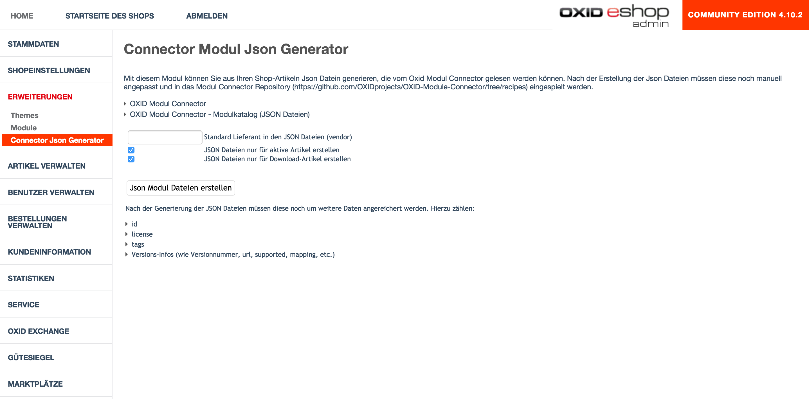

# OXID-Module-Connector-Generator
Oxid module to generate json files from shop articles for the OXID module connector.

## Installation

1. [download OXID Modul Connector Generator](https://github.com/Alpha-Sys/OXID-Module-Connector-Generator/archive/master.zip)
2. Extract file
3. Copy contents of copy_this into your shop
3. Activate module
4. That´s it!

## Screenshots

## License
OXID module connector generator is licensed under the MIT License - see the [LICENSE file](https://github.com/Alpha-Sys/OXID-Module-Connector-Generator/blob/master/LICENSE) for details.
